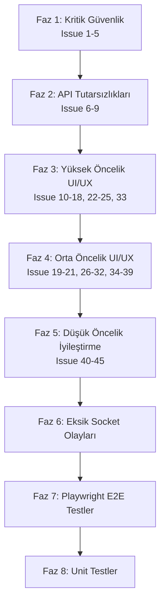

## Plan Karşılaştırması

İki farklı model planı incelendi:

| Kriter | Plan 1 (Claude) | Plan 2 (Gemini) |
|---|---|---|
| **Faz yapısı** | 8 granüler faz, öncelik bazlı | 5 faz, fonksiyonel alan bazlı |
| **Mevcut kod analizi** | Derin — #17 ve #18'in zaten kısmen çalıştığını tespit etti | Yüzeysel — tüm sorunları "yapılacak" olarak listeledi |
| **Backend boşlukları** | Kitchen router'da `requireRole` eksikliğini tespit etti | Sadece frontend fix'e odaklandı |
| **Risk analizi** | SaaS async tenant creation'ı en yüksek risk olarak tanımladı | Risk analizi yok |
| **Yeni dosya/komponent listesi** | 34 dosya manifest'i, yeni komponentler listeli | Dosya listesi belirsiz |

**Öneri:** Plan 1'in derinliği ve mevcut kod analiziyle Plan 2'nin fonksiyonel gruplama yaklaşımının birleşimi. Plan 1'in detaylı dosya manifest'i ve backend boşluk tespitleri temel alınıyor.

---

## Genel Akış



---

## Faz 1: Kritik Güvenlik (Issue #1-5)

### 1.1 — `/handover` Rol Guard'ı (Issue #1)

**Dosyalar:**
- `apps/pos/src/App.tsx` (satır 168)
- `apps/api/src/routes/` (handover rotası varsa backend'de de kontrol)

**Değişiklik:**
- `App.tsx` satır 168'deki `<ProtectedRoute>` yerine yeni `HandoverRoute` bileşeni oluştur:
```tsx
const HANDOVER_ROLES = new Set(['admin', 'cashier']);
const HandoverRoute: React.FC<{ children: React.ReactNode }> = ({ children }) => {
    const { isAuthenticated, user } = useAuthStore();
    if (!isAuthenticated) return <Navigate to="/login" replace />;
    if (!user?.role || !HANDOVER_ROLES.has(user.role)) return <Navigate to="/cashier" replace />;
    return <>{children}</>;
};
```
- `/handover` rotasını `<HandoverRoute>` ile sar

### 1.2 — KDS'ten Cashier Erişimini Kaldır (Issue #2)

**Dosyalar:**
- `apps/pos/src/App.tsx` (satır 66)
- `apps/api/src/routes/kitchen.ts` (satır 18-19) — **Backend boşluğu!**

**Değişiklik:**
- Frontend: `KITCHEN_ROLES` set'inden `'cashier'` kaldır:
  ```tsx
  const KITCHEN_ROLES = new Set(['kitchen', 'admin']);
  ```
- Backend: `apps/api/src/routes/kitchen.ts`'de `requireTenantModule('kitchen_display')` satırının yanına `requireRole('kitchen', 'admin')` ekle
- **Opsiyonel:** `cashier_kds_view` entitlement ile salt-okunur erişim sağlanabilir (ikinci iterasyonda)

### 1.3 — Finansal Kayıt Silme Engellemesi (Issue #3, #5, #26)

**Dosyalar:**
- `apps/api/src/routes/admin.ts` (satır 141-143) — DELETE rotasını kaldır
- `apps/api/src/controllers/admin.accounting.controller.ts` (satır 142-208) — `deleteTransaction` → `voidTransaction` dönüştür
- `apps/pos/src/pages/AdminAccounting.tsx` — `FiTrash2` butonunu kaldır, storno butonu ekle

**Değişiklik:**
- Backend: `DELETE /admin/accounting/:id` rotasını kaldır
- Backend: `POST /admin/accounting/:id/void` endpoint'i ekle — orijinal kaydı silmez, `type: 'void'`/`type: 'refund'` yeni kayıt oluşturur
- Frontend: Silme butonunu kaldır, yerine "Storno" butonu koy, onay dialogu ekle
- `'deleted'` tab'ını kaldır veya `'voided'` olarak yeniden adlandır

### 1.4 — Demo Seed Production Koruması (Issue #4)

**Dosya:** `apps/api/src/controllers/admin.settings.controller.ts` (satır ~245)

**Değişiklik:**
```ts
if (process.env.NODE_ENV === 'production') {
    return res.status(403).json({ error: 'Demo seed is disabled in production', code: 'FORBIDDEN' });
}
```

### 1.5 — `/saas-admin` Rota Koruması

**Dosya:** `apps/pos/src/App.tsx` (satır 119)

**Not:** `SaaSAdmin` kendi internal login formuna sahip (`useSaaSStore`). Ancak rota düzeyinde en azından bir guard olmalı.

**Değişiklik:** `SaaSAdmin` bileşeninin kendi auth flow'unu koruduğu doğrulandıktan sonra, rota seviyesinde `SaaSAdminRoute` ekle (internal login'i bozmadan).

---

## Faz 2: API Tutarsızlıkları (Issue #6-9)

### 2.1 — PATCH vs PUT (Issue #6)

**Dosyalar:**
- `apps/api/src/routes/orders.ts`
- `apps/api/src/routes/admin.ts` (satır 140)
- İlgili controller'lar

**Değişiklik:** Tüm kısmi güncelleme rotalarında `PUT` → `PATCH` dönüşümü. Eski `PUT` endpoint'leri kısa süre deprecated alias olarak tutulabilir.

### 2.2 — Sipariş/Checkout Ayrımı (Issue #7)

**Dosya:** `apps/api/src/routes/orders.ts` (satır 29-34)

**Değişiklik:** `POST /orders/checkout-session` deprecated olarak işaretle. `POST /orders` (kayıt) ve `POST /orders/checkout` (mutfağa gönder) net ayrımını belgele ve frontend çağrılarını güncelle.

### 2.3 — Kurye Durum Geçişleri (Issue #8)

**Dosya:** `apps/api/src/controllers/orders.controller.ts`

**Değişiklik:** Durum geçiş matrisi ekle:
```ts
const VALID_TRANSITIONS = { ready: ['shipped'], shipped: ['delivered', 'failed'] };
```
Geçersiz geçişlerde `400 Bad Request` dön.

### 2.4 — Personel Performans Endpoint'i (Issue #9)

**Dosya:** `apps/api/src/routes/admin.ts` (satır 85-86)

**Değişiklik:** `personnel-detailed` ve ayrı endpoint'leri `GET /admin/reports/staff-performance?role=waiter|courier` altında birleştir. Eski endpoint'leri redirect ile deprecated yap.

---

## Faz 3: Yüksek Öncelik UI/UX

### 3.1 — Masa Grid Renk Kodları (Issue #10)

**Dosya:** `apps/pos/src/features/terminal/` altındaki masa grid bileşeni

**Değişiklik:** Renk standartları:
| Durum | Renk |
|---|---|
| Boş | 🟢 Yeşil |
| Dolu | 🔴 Kırmızı |
| Sipariş Bekliyor | 🟡 Sarı |
| Hesap İstedi | 🔵 Mavi |
| Yemek Hazır | 🟠 Turuncu |
| Rezerveli | 🟣 Mor |

### 3.2 — `table:focused/blurred` Overlay (Issue #11)

**Dosyalar:**
- `apps/pos/src/hooks/useCashierRealtimeSync.tsx` (satır 224-225 — **zaten subscribe ediyor!**)
- Masa kartı bileşeni

**Not:** Backend socket olayları ve frontend subscription zaten mevcut. Eksik olan sadece **görsel overlay**.

**Değişiklik:** Masa kartına "Bu masaya [İsim] bakıyor" overlay bileşeni ekle, `table:focused` verisiyle eşleştir.

### 3.3 — Offline Mod Banner (Issue #12)

**Yeni dosya:** `apps/pos/src/components/OfflineBanner.tsx`

**Değişiklik:** `navigator.onLine` + `online/offline` event listener ile header'da belirgin banner göster. Sync bekleyen sipariş sayısını Dexie `syncQueue.count()` ile göster.

### 3.4 — KDS Drag-Drop → API (Issue #15)

**Dosya:** `apps/pos/src/pages/KitchenMonitor.tsx`

**Değişiklik:** `@hello-pangea/dnd` (veya mevcut bir DnD kütüphanesi) ile sütunlar arası sürükleme → `onDragEnd` callback'inde `PATCH /kitchen/tickets/:id/status` çağrısı.

### 3.5 — KDS Süre Sayacı Eşikleri (Issue #16)

**Dosya:** `apps/pos/src/pages/KitchenMonitor.tsx` (satır 84-93)

**Mevcut:** `>10: amber, >15: orange, >20: red animate-pulse`
**Hedef:** `<5: beyaz/yeşil, 5-15: sarı, >15: kırmızı animate-pulse`

### 3.6 — KDS İstasyon Filtresi (Issue #17)

**Dosya:** `apps/pos/src/pages/KitchenMonitor.tsx` (satır 278-281)

**Not:** Mevcut kod **zaten** station parametresini API'ye geçiriyor olabilir. **Önce doğrula**, eksikse düzelt.

### 3.7 — KDS Kalem Bazlı Checkbox (Issue #18)

**Dosya:** `apps/pos/src/pages/KitchenMonitor.tsx` (satır 393)

**Not:** `updateTicketItems` fonksiyonu **zaten** `PATCH /api/v1/kitchen/tickets/:id/items` çağırıyor. **Önce doğrula** — backend'in `is_ready` flag'ini persist edip socket emit ettiğini kontrol et.

### 3.8 — Kiosk Token Doğrulama (Issue #22)

**Dosya:** `apps/pos/src/pages/KioskCustomerMenu.tsx`

**Değişiklik:** `useEffect` mount'ta `GET /devices/:token/verify` çağır. Geçersizse kilit ekranı göster.

### 3.9 — Kiosk Token Revoke Auto-Lock (Issue #23)

**Değişiklik:** Socket `sync:tables_changed` veya özel `device:revoked` olayı dinle → pasif kilit ekranına geç.

### 3.10 — Kiosk Idle Timer (Issue #24)

**Değişiklik:** 90s inactivity timer (`mousemove`, `touchstart`, `keydown` event'leri) → menü başlangıç ekranına reset.

### 3.11 — Kiosk Sipariş Durumu Tracking (Issue #25)

**Değişiklik:** Sipariş sonrası socket `order:ready` dinle → "Siparişiniz hazır!" animasyonlu ekran göster.

### 3.12 — SaaS Tenant Oluşturma Async (Issue #33)

**Dosyalar:**
- `apps/api/src/controllers/tenants.controller.ts` — 202 + taskId dön
- `apps/pos/src/store/useSaaSStore.ts` (satır 950-955) — polling logic ekle
- `apps/pos/src/pages/saas/TenantsTab.tsx` — progress bar UI

**Not:** **En yüksek risk alanı.** Backend'de BullMQ task queue + `tasks` DB tablosu gerekebilir.

**Değişiklik:**
- Backend: `createTenantHandler` → `202 Accepted` + `{ taskId }` dön, BullMQ worker ile async işle
- Backend: `GET /api/saas/v1/tasks/:id/status` endpoint'i ekle
- Frontend: `createTenant` action'ı 202 response sonrası polling başlat, progress bar göster

---

## Faz 4: Orta Öncelik UI/UX

### 4.1 — Garson: Servis Çağrısı Overlay (Issue #19)

**Dosya:** `apps/pos/src/pages/WaiterPanel.tsx` (satır 885)

**Not:** `customer:service_call` handler **zaten mevcut**. Eksik olan görsel overlay.

**Değişiklik:** Masa kartı üzerinde animasyonlu servis çağrısı badge/overlay ekle.

### 4.2 — Garson: QR Sipariş Onay Pop-up (Issue #20)

**Dosya:** `apps/pos/src/pages/WaiterPanel.tsx` (satır 988)

**Not:** `customer:order_request` handler **zaten mevcut**. Eksik olan tam onay/ret dialog.

**Değişiklik:** Modal dialog ekle: sipariş detayları + Onayla/Reddet butonları → `customer:order_approved` / `customer:order_rejected` emit.

### 4.3 — Garson: Varyant/Modifikasyon UX (Issue #21)

**Dosya:** `apps/pos/src/pages/WaiterPanel.tsx`

**Değişiklik:** Masa başı sipariş modalında varyant seçimi ve modifikasyon grubu UI'ını tamamla.

### 4.4 — Admin: Muhasebe Silme Butonu (Issue #26)

**Not:** Faz 1.3'te çözülüyor. Storno UI'ı eklenecek.

### 4.5 — Rezervasyon Socket Bildirimi (Issue #27)

**Dosyalar:**
- `apps/api/src/controllers/admin.reservations.controller.ts` — `reservation:created` emit
- `apps/api/src/socket/index.ts` — event handler ekle

### 4.6 — Stok `is_ingredient` İşaretleme (Issue #28)

**Dosya:** `apps/pos/src/pages/AdminStock.tsx`

**Değişiklik:** `is_ingredient: true` olan ürünleri ayrı badge/ikon ile işaretle.

### 4.7 — Kiosk Ayarları Sekmesi (Issue #29)

**Dosya:** `apps/pos/src/pages/AdminSettings.tsx`

**Değişiklik:** Yeni "Kiosk" tab: cihaz listesi, token revoke butonu, idle timeout ayarı.

### 4.8 — Yazıcı Test Feedback (Issue #30)

**Dosya:** İlgili admin yazıcı bileşeni

**Değişiklik:** `POST /admin/printers/:id/test` response'unu UI'a yansıt (başarı/hata toast).

### 4.9 — Entitlement Modül Kilidi CTA (Issue #31)

**Yeni dosya:** `apps/pos/src/components/ModuleLockedCTA.tsx`

**Değişiklik:** Kilitli modüller boş sayfa yerine "Bu özellik planınızda yok — Yükselt" CTA göstersin.

### 4.10 — Çeviri Editörü (Issue #32)

**Dosya:** Admin ayarlar altında yeni bileşen

**Değişiklik:** DE/TR/EN yan yana form → `PUT /translations/:ns/:lang` çağrısı.

### 4.11 — DNS Provisioning Hata (Issue #34)

**Dosya:** `apps/pos/src/pages/saas/TenantsTab.tsx`

**Değişiklik:** `qr_domain_status: 'pending_dns'` uyarı badge + "Yeniden Dene" butonu → `POST /tenants/:id/retry-dns`.

### 4.12 — Impersonation Banner (Issue #35)

**Yeni dosya:** `apps/pos/src/components/ImpersonationBanner.tsx`

**Değişiklik:** JWT'de impersonation flag varsa kalıcı "Destek Modu Aktif" banner göster.

### 4.13 — Impersonation Yıkıcı İşlem Engeli (Issue #36)

**Değişiklik:** Impersonation token ile delete/seed işlemlerini frontend'de de engelle (butonları disable et, uyarı göster).

### 4.14 — SaaS Live Feed (Issue #37)

**Dosya:** `apps/pos/src/pages/saas/DashboardTab.tsx`

**Değişiklik:** `saas:live_feed` socket kanalına bağlan, canlı event akışını dashboard'da göster.

### 4.15 — Bayi Top-up Talebi (Issue #38)

**Dosya:** Reseller panel bileşeni

**Değişiklik:** Top-up talep formu + `POST /resellers/me/wallet/topup-request` + durum takibi listesi.

### 4.16 — Komisyon Raporu PDF (Issue #39)

**Değişiklik:** PDF export butonu → backend'den PDF stream veya frontend'de jsPDF ile oluştur.

---

## Faz 5: Düşük Öncelik İyileştirme (Issue #40-45)

### 5.1 — Toast/Bildirim Sistemi (Issue #40)

**Değişiklik:** `react-hot-toast` zaten mevcut. Tüm panellerde tutarlı kullanım için merkezi wrapper bileşen oluştur.

### 5.2 — 2FA Akışı (Issue #41)

**Dosya:** `apps/pos/src/pages/LoginPage.tsx`

**Değişiklik:** Login response'da `requires2FA: true` gelirse TOTP giriş adımı göster. Backend zaten destekliyor.

### 5.3 — i18n Hard-coded String'ler (Issue #42)

**Dosyalar:** Tüm bileşenler taranacak

**Değişiklik:** Hard-coded Türkçe string'leri `t('key')` ile değiştir, `posMessages.ts` ve `saas/messages.ts`'e key ekle.

### 5.4 — Responsive/Mobile CSS (Issue #43)

**Dosyalar:** Garson ve kurye panelleri

**Değişiklik:** Tailwind breakpoint'leri (`sm:`, `md:`, `lg:`) ile tablet/mobil optimizasyon.

### 5.5 — Loading Skeleton'lar (Issue #44)

**Yeni dosya:** `apps/pos/src/components/LoadingSkeleton.tsx`

**Değişiklik:** API çağrıları sırasında skeleton loader göster (spinner yerine).

### 5.6 — Error Boundary (Issue #45)

**Yeni dosya:** `apps/pos/src/components/ErrorBoundary.tsx`

**Değişiklik:** Global React Error Boundary + API hataları için fallback UI.

---

## Faz 6: Eksik Socket Olayları

**Dosya:** `apps/api/src/socket/index.ts` + ilgili controller'lar

| Olay | Emit Kaynağı | Hedef Room |
|---|---|---|
| `reservation:created` | Rezervasyon controller | `branch:{id}` |
| `saas:live_feed` | Tenant/payment controller | `room:saas_admin` |
| `stock:low` | Stok controller (threshold check) | `admin:{id}` |
| `menu:updated` / `sync:menu_revision` | Menü admin controller | `tenant:{id}` |
| `saas:topup_request_new` | Reseller wallet controller | `room:saas_admin` |

Her controller'da `req.app.get('io').to(room).emit(event, data)` pattern'i kullanılacak.

---

## Faz 7: Playwright E2E Testler

**Dizin:** `e2e/`

### 7.1 — Tam Salon Siparişi (`e2e/pos-full-order.spec.ts`)
```
Login (cashier/PIN:123456) → Masa seç → Oturum aç → Kategori → Ürün → Varyant → Modifikasyon → Sepet → Sipariş gönder → KDS'te bilet doğrula → waiting→preparing→ready → Socket order:ready → Ödeme (nakit) → Para üstü → Adisyon → Masa kapanış
```

### 7.2 — Offline Mod (`e2e/pos-offline.spec.ts`)
```
page.context().setOffline(true) → "Offline Mod" banner doğrula → Sipariş oluştur → IndexedDB doğrula → Ödeme dene → "Bağlantı gerekli" uyarı → setOffline(false) → Sync otomatik → Sunucuda sipariş doğrula
```

### 7.3 — QR → Garson Onayı (`e2e/qr-waiter-approval.spec.ts`)
```
Multi-context: Context 1 (müşteri QR) + Context 2 (garson panel) → Müşteri sipariş gönder → Garson panelinde pop-up doğrula → Onayla → KDS'te ticket doğrula → Müşteri ekranında "Hazırlanıyor" doğrula
```

### 7.4 — Kiosk Cihaz Akışı (`e2e/kiosk-device.spec.ts`)
```
device_token ile /kiosk/:tableId aç → Token verify çağrısı doğrula → Menü yüklensin → Sipariş ver → 90s idle (timer fast-forward) → Başlangıç ekranı → Token revoke → Kilit ekranı
```

### 7.5 — SaaS Tenant Oluşturma (`e2e/saas-tenant-create.spec.ts`)
```
SaaS admin login → Tenant oluştur → 202 response doğrula → Progress bar doğrula → Polling doğrula → Success bildirim → Tenant listede görünme
```

---

## Faz 8: Unit Testler

### 8.1 — Offline Sync Çakışma Çözümü
```ts
describe('SyncManager', () => {
  it('should skip offline update if server state is ahead');
  it('should queue orders in IndexedDB when offline');
  it('should flush pending sync on reconnect');
  it('should log conflict when states diverge');
  it('should invalidate cache on menu_revision');
});
```

### 8.2 — RBAC Guard Testleri
```ts
describe('RBAC', () => {
  it('cashier cannot access /kitchen route → 403');
  it('waiter cannot access /handover → 403');
  it('admin can access /handover → 200');
  it('cashier can access /handover → 200');
  it('device token cannot access admin routes → 403');
  it('reseller sees only own tenants');
  it('demo seed returns 403 in production');
});
```

---

## Yeni Dosya Manifest'i

| Dosya | Tür |
|---|---|
| `apps/pos/src/components/OfflineBanner.tsx` | Yeni |
| `apps/pos/src/components/ImpersonationBanner.tsx` | Yeni |
| `apps/pos/src/components/ErrorBoundary.tsx` | Yeni |
| `apps/pos/src/components/LoadingSkeleton.tsx` | Yeni |
| `apps/pos/src/components/ModuleLockedCTA.tsx` | Yeni |
| `e2e/pos-full-order.spec.ts` | Yeni |
| `e2e/pos-offline.spec.ts` | Yeni |
| `e2e/qr-waiter-approval.spec.ts` | Yeni |
| `e2e/kiosk-device.spec.ts` | Yeni |
| `e2e/saas-tenant-create.spec.ts` | Yeni |

---

## Doğrulama Kriterleri (DoD)

| Adım | Hedef Dosyalar | Doğrulama |
|---|---|---|
| 1.1 | `App.tsx`, `HandoverPanel.tsx` | Waiter rolü `/handover` → redirect |
| 1.2 | `App.tsx`, `routes/kitchen.ts` | Cashier → `/kitchen` = 403 + redirect |
| 1.3 | `routes/admin.ts`, `AdminAccounting.tsx` | `DELETE /accounting/:id` → 404/405 |
| 1.4 | `admin.settings.controller.ts` | `NODE_ENV=production` → seed = 403 |
| 3.4 | `KitchenMonitor.tsx` | Drag-drop → API call doğrulama (network tab) |
| 3.8-3.11 | `KioskCustomerMenu.tsx` | Token verify + idle + revoke + tracking |
| 3.12 | `tenants.controller.ts`, `useSaaSStore.ts` | 202 + polling + progress bar |
| 7.x | `e2e/*.spec.ts` | `npx playwright test` tüm test'ler geçer |
| 8.x | Unit test dosyaları | `npm test` tüm test'ler geçer |

---

## Risk Alanları

1. **SaaS Async Tenant Creation (Issue #33):** Backend'de BullMQ task queue + `tasks` DB tablosu gerekebilir. İki app'i (api + pos) etkiler.
2. **KDS Drag-Drop (Issue #15):** Yeni DnD kütüphanesi (`@hello-pangea/dnd`) eklenecek — bundle size etkisi değerlendirilmeli.
3. **Issue #17 ve #18:** Mevcut kod zaten çalışıyor olabilir — **önce doğrula, sonra düzelt**.
